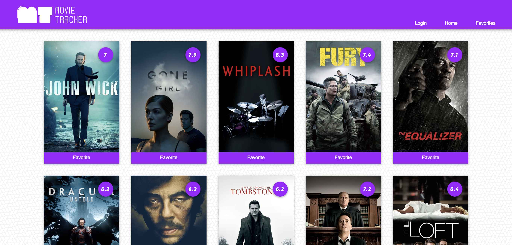
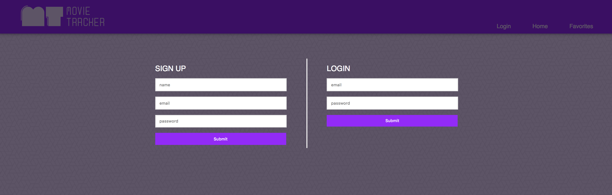

# Movie-Tracker

Movie-Tracker is an app designed to display data using the moviedb API.  It has functionality allowing users to view upcoming movies, their description and their overall rating.  Users are also able to select favorites from from the list of movies and view them later under the favorites button. The main goal of this project was to learn about how to use redux, router, TDD as well as gain a better understanding of react.


## Getting Started

These instructions will get you a copy of the project up and running on your local machine for development and testing purposes. See deployment for notes on how to deploy the project on a live system.


### Installing

A step by step series of examples that tell you have to get a development env running

Say what the step will be

```
Clone the repositorys (git clone https://github.com/daughedm/Movie-Tracker.git) & (git clone https://github.com/turingschool-examples/movie-tracker).
```
```
npm install
```
```
npm start
```

## Running the tests

In the terminal, 

```
npm test
```

## Built With

* [Creat-React-App](https://github.com/facebook/create-react-app) - The web framework used

## Authors

***David Daugherty** - *Initial work* - [daughedm](https://github.com/daughedm)
***Alan Charles** - *Initial work* - [abomb14c](https://github.com/abomb14c)
***Sage Vogt** - *Initial work* - [sagevangogt](https://github.com/sagevangogt)
